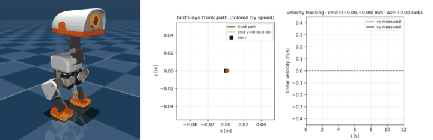

# shinro-demo-microduck

A **Microduck** reference-robot demo for the [shinro control framework](https://github.com/Shinro-xyz/shinro-python-modules):
a 14-servo, ~25 cm biped whose walking policy was trained with PPO, exported to
ONNX, and here **compiled to a standalone shared object** — then driven in MuJoCo
from that kernel through its C ABI:

```c
void shinro_step(const double* in, double* out, double* state);
```

Everything robot-specific the framework deliberately does not ship lives here: the
vendored MJCF + meshes, the policy ONNX, the BAM actuator mirror, the configs and
scenarios, the demos and the integration tests.

## What this does uniquely

**The policy is the artifact, and the sim is driven from it.** Not a
re-implementation and not a wrapped runtime: the observation encoder, the network
and the action post-processing are lowered to a shinro dataflow graph and
cross-compiled with Zig, and the 50 Hz control loop calls that `.so`. onnxruntime
appears only in the comparison harness and one fidelity test — never in the
control path.

**Correctness is three independent implementations agreeing**, not one
self-consistent run — a build-time oracle gate, a per-tick comparison against
shinro's own interpreter, and both against onnxruntime. The numbers are in
[Results at a glance](#results-at-a-glance). There is no hand-converted checkpoint
anywhere: the observation normalizer is
baked into the ONNX by the training repo's exporter, which is the only path that
transfers.

**The deployment host is the code that ships — and it is measured.**
`MicroduckPolicy` is ctypes plus the standard library: no numpy, no framework, no
MuJoCo, buffers allocated once at load, dimensions read from the artifact
manifest. `make footprint` puts it at **0.8 MB installed, +1.2 MB RSS, 7.9 ms to
first inference**, against onnxruntime's 132.8 MB, +44.8 MB and 121 ms. The
no-dependency claim is *asserted by a test in a fresh interpreter*, not asserted
in prose — and demonstrated from the other side by
[`interop/`](interop/README.md) (`make interop`), which drives the same `.so`
from C, C++, Zig and Python with one input: three of the four hosts have no
Python at all, so the ABI is language-agnostic rather than merely Python-loadable.

**The same artifact is measured on the target.** A Raspberry Pi 3 B+ runs it at
**750 µs median** (p99 856), 12.7 MB RSS, **4 KB of RSS growth over 100,000
ticks** and 1 minor page fault — latency and a flat memory curve, not just "it
compiles".

**The constraints on deploying it were measured on this checkpoint, not assumed.**
Each one changes what a runtime should do, and each is pinned by a test:

- a **~0.25 m/s deadband** — a slow command produces a *stand*, not a crawl, so a
  runtime should hot-swap a stand policy rather than ask the walker to creep;
- a **yaw response that is non-monotonic in the command** (0.4 rad/s commanded →
  0.54 achieved, 0.6 → 0.03) — no open-loop heading profile survives it, so a
  waypoint tracker has to close the loop on heading;
- **no turn-in-place**, and **feet-only collision geometry**, which makes the walk
  scene useless for fall-recovery work;
- the **home pose is not a self-stabilizing equilibrium** (the CoM sits ~5 mm
  ahead of the ankle axis) — the policy does the balancing, so "fixing" it by
  stiffening the hold would be wrong.

**The framework's component contract is exercised by a real robot.** The reference
path is a registered `TrajectoryGenerator` and the path tracker a registered
`Controller`, built through shinro's own factories — and shinro's *other*
generators plug into it unchanged, because the tracker only ever sees a
`(steps, 2)` schedule.

> **What this is not:** a sim2real claim. It is a rehearsal that matches the
> training actuator, timing and frame conventions exactly. See
> [Fidelity](docs/fidelity.md) for what is reproduced and what is not.

## How a command reaches the robot

The tracker is Python running *beside* the kernel, once per tick. It never talks to
the policy directly: it writes a 13-D command block into the sim, the sim packs that
block into the 61-D observation, and the observation is the kernel's **only** input.
The command reaches the robot *inside* the observation, not alongside it.

```
  configs/trajectories/*.toml             configs/controllers/*.toml
  type = "microduck_loop"                 type = "microduck_pure_pursuit"
           │                                        │
           ▼                                        ▼
  TrajectoryFactory ─┐                    ControllerFactory ─┐    ← shinro's registries
           │         │ resolve "type"               │         │ resolve "type"
           ▼         │                              ▼         │
    MicroduckLoop ───┘                       PurePursuitTracker
  (TrajectoryGenerator)                        (Controller)
           │                                        │
           │ from_config() ──► (steps, 2) xy        │ set_reference(path)
           ▼                                        ▼
     ReferencePath ────────────────────────► compute([x, y, yaw, ẏ])
       (points + arc length)                          │
                                                      ▼
                                         13-D command block
                                [ twist(3) │ head_pose(4) │ body_pose(6) ]
                                                      │
  ═════════════════════════════════ the kernel boundary ═══════════════════════════════
                                                      │
                       sim.command[:] = block         │
                                                      ▼
  ┌─ MicroduckSim.observation() ───────────────────────────────────────────────────────┐
  │ 61-D = [ ang_vel(3) │ gravity(3) │ qpos(14) │ qvel(14) │ last_a(14) │ COMMAND(13) ]│
  │             0:3          3:6        6:20       20:34       34:48         48:61     │
  │                                                       ▲            ▲               │
  │                     previous action feeds back ───────┘            │               │
  │                                       twist 48:51 │ head 51:55 │ body 55:61        │
  └────────────────────────────────────────────────────────────────────────────────────┘
                                                      │  obs (61 floats)
                                                      ▼
                        MicroduckPolicy.step(obs)      ← ctypes + stdlib, preallocated
                                                      │
                        shinro_step(obs[61] → action[14])   ← the compiled .so
                                                      │
                                                      ▼  u = 14 joint position OFFSETS
                        q_target = HOME + u · action_scale(1.0)
                                                      │
                                                      ▼
                        BAM M6 voltage actuator  →  ×10 physics substeps  →  MuJoCo
                                                      │
                                                      └──► next tick: x, y, yaw, ẏ
                                                           back to the tracker
```

Three things this pins down:

- **The command block is zero-padded, never trimmed.** `twist` is what the walking
  policy rewards; `head_pose` is a small secondary objective and `body_pose` was
  trained at weight 0 (kept alive so a later curriculum can use it). The tracker
  writes `twist` and leaves the other ten entries at zero. Deleting an unused slot
  would move every byte after it and invalidate the whole policy family.
- **The action is an offset, not an angle.** `q_target = HOME + action`, with
  `action_scale = 1.0` read from the ONNX metadata rather than assumed — the policy
  outputs displacements from the home pose.
- **`last_action` is fed back** (obs[34:48]). That is why the compiled graph needs no
  recurrent ports: the policy's own previous output returns to it through the
  observation.

On the real robot the same chain runs with different ends — the observation is
assembled from the IMU and servo encoders, and the 14-D action becomes joint targets
on the Dynamixel bus. The trajectory layer is navigation instead of a preset file;
the command still reaches the policy the same way, inside the observation.

## Results at a glance

| stage | artifact | check | measured |
| ----- | -------- | ----- | -------- |
| import | ONNX → 26-node graph | imported graph vs **onnxruntime** (spec reference) | `9.1e-07` (f32 vs f64) |
| compile | `lib/lib_neural_network.so` · 790 KiB | `shinro build` oracle gate: `.so` vs interpreter | `3.3e-16` |
| replay | 50 Hz MuJoCo loop driven from the `.so` | **lockstep parity** per tick, kernel vs interpreter | `≤ 8.9e-16` |
| deploy | `.so` through `MicroduckPolicy` | install size, RSS, time to first inference | `0.8 MB`, `+1.2 MB`, `7.9 ms` |
| embed | the same `.so` from C, C++, Zig, Python | four independent hosts agree | **bit-identical** |
| track | preset reference path, closed loop | cross-track error / path coverage | `8.6 mm` mean / `100%` on a 1 m circle |

The replay is driven *only* by the compiled kernel's action, through the ctypes
deployment host. The eager interpreter runs the same graph on the same observation
each tick purely as a reference — that lockstep comparison is the honest
correctness check, and it is floating-point exact.

## Quickstart

```bash
make install         # the sibling shinro checkout + this repo's extras
make compile         # ONNX -> lib/lib_neural_network.so (runs the oracle gate)
make live            # watch it: real-time MuJoCo viewer, keys switch command
make gif             # the small showcase GIF this README embeds
make trajectory T=circle   # walk a preset reference path
make demo            # per-command GIFs (composite: 3-D view, path, velocity)
make footprint       # deployment host vs shinro adapter vs onnxruntime (+ on-Pi numbers)
make check           # framework gate: both components construct from their TOML
make verify          # framework gate: the stamped artifact matches its record
make interop         # the same .so through C, C++, Zig, and Python
make test            # contract, sim, host, parity, kernel, components
```

`make compile` is `shinro build scenarios/microduck_walking.toml --out build/compiled_policy`,
which traces → composes → lowers → `zig build` → **oracle-checks the `.so` against
the interpreter** → stamps and verifies the artifact. Nothing is trusted until that
gate passes. On their own, `make check` re-runs the framework's construction gate
(every component builds through its factory) and `make verify` re-hashes the
stamped artifact against its deployment record — both run in CI.

Replay one command, or skip the renderer:

```bash
python -m demos.demo_compiled_policy forward
python -m demos.demo_compiled_policy --no-video            # metrics only
MUJOCO_GL=glfw python -m demos.demo_compiled_policy        # desktop GL
```

Output: `build/demos/microduck_compiled_<command>.gif` — a composite of the 3-D
view, a bird's-eye trunk path colored by speed, and the velocity-tracking panel.

## Watch it



_Standing → walking → turning: one continuous 12 s run with the command switched
mid-flight, whose only control law is the compiled `.so`._

`make live` opens a real-time viewer at the policy's 50 Hz — keys `0`–`4` switch
the command, `R` resets, `+`/`-` resize the window. It needs a display
(`MUJOCO_GL=glfw` on a desktop, `egl` headless). More in
[Watching it](docs/watching.md), including full-lap GIFs of every preset
reference path.

## Docs

| document | what's in it |
| -------- | ------------ |
| [compiled-inference.md](docs/compiled-inference.md) | the trace → compose → lower → oracle chain, and why the normalizer is baked in |
| [policy-contract.md](docs/policy-contract.md) | the 61-D observation and 14-D action layout, verified against the ONNX metadata |
| [footprint.md](docs/footprint.md) | deployment host vs shinro adapter vs onnxruntime: install size, RSS, latency, and the on-Pi numbers |
| [interop/README.md](interop/README.md) | the same kernel through C, C++, Zig and Python — the C ABI, not the Python binding |
| [trajectories.md](docs/trajectories.md) | preset reference paths as registered shinro components, and why tracking must be closed loop |
| [fidelity.md](docs/fidelity.md) | what this rehearsal reproduces, what it does not, and the three behaviours worth knowing |
| [watching.md](docs/watching.md) | GIFs, the viewer, and MuJoCo's fixed viewer-window size |
| [layout.md](docs/layout.md) | repo layout, the package, and the component `--import` contract |
| [provenance.md](docs/provenance.md) | which checkpoint this policy is, and where it came from |

## Provenance

`BEST_alpha_walking.onnx` is the export of the **deployed** Microduck walking
policy: Weights & Biases run `441tzs6d` @ `model_3750`, published at
[`xiaofengzi/microduck-walking-onnx`](https://huggingface.co/xiaofengzi/microduck-walking-onnx).
It is a 61→512→256→128→14 MLP (197,896 parameters including the baked observation
normalizer). The MJCF, meshes and BAM settings are vendored verbatim from the
training repo (`mjlab-microduck`), so the replay runs the same asset the policy was
trained on. Details in [provenance.md](docs/provenance.md).
