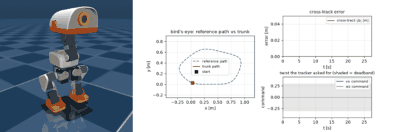

*Part of [shinro-demo-microduck](../README.md).*

# Preset trajectories

```bash
make trajectory T=circle LAPS=2 # circle | figure_eight | straight | slalom | waypoints_example
make trajectory-gif             # the short GIF below -> docs/media/
python -m demos.demo_compiled_policy --trajectory figure_eight --laps 2
```

This is the deployment shape: navigation produces waypoints, a tracker converts
them into a twist command each tick, and the compiled policy executes it. The
policy stays a velocity tracker — this layer runs *outside* the kernel and never
replaces it.

Both halves are **shinro components**, not demo-local helpers — each subclasses a
framework ABC, declares a frozen `Config` dataclass as its TOML schema, and
registers itself:

| component | ABC | registered as | config |
| --------- | --- | ------------- | ------ |
| `MicroduckLoop` | `TrajectoryGenerator` | `microduck_loop` | `configs/trajectories/*.toml` |
| `PurePursuitTracker` | `Controller` | `microduck_pure_pursuit` | `configs/controllers/pure_pursuit.toml` |

so they build through the framework's own factories and plug into a scenario:

```python
from shinro.factories.trajectory_factory import TrajectoryFactory
from shinro.factories.controller_factory import ControllerFactory

schedule = TrajectoryFactory("configs/trajectories/circle.toml").create()   # (steps, 2)
tracker  = ControllerFactory("configs/controllers/pure_pursuit.toml").create()
tracker.set_reference(ReferencePath(schedule))
twist = tracker.compute([x, y, yaw, yaw_rate])                              # 13-D command
```

Registration is an import side effect, so a scenario needs the component module —
the same contract every shinro plugin follows:

```bash
shinro build scenarios/<name>.toml --import shinro_demo_microduck.tracker
```

(`tracker` imports `trajectory`, so one `--import` registers both.) `tests/test_shinro_components.py`
holds this contract: both names resolve in the registries, unknown config keys and
a wrong `type` fail loudly, `from_config` emits the framework's `(steps, 2)`
schedule, and **shinro's own generators plug in unchanged** — the tracker only ever
sees a schedule, so its own `lissajous` figure drives the real robot in a test.

**Why a new generator type at all.** shinro's existing trajectories are rest-to-rest
motions from one configuration to another over a fixed duration. A walking policy
needs an *endless* reference that closes on itself, because the robot has to keep
walking. `microduck_loop` is that missing piece, and it says so: its `generate()`
is a documented no-op, since a loop has no start/end to interpolate.



_A full lap of the 5-waypoint loop (27 s, 8 fps): the path visibly closes. The
composite shows reference vs actual path, the cross-track error, and the twist the
follower asked for — with the policy's deadband shaded, so you can see the
follower never asks for a speed inside it._

Each preset has a full-lap GIF of its own — reference vs actual, cross-track
error, and the command:

| path | GIF | what it shows |
| ---- | --- | ------------- |
| `circle` | [`microduck_trajectory_circle.gif`](media/microduck_trajectory_circle.gif) | constant curvature, the easy case |
| `figure_eight` | [`microduck_trajectory_figure_eight.gif`](media/microduck_trajectory_figure_eight.gif) | yaw command reverses twice per lap |
| `straight` | [`microduck_trajectory_straight.gif`](media/microduck_trajectory_straight.gif) | open reference: walks 2 m and stops |
| `slalom` | [`microduck_trajectory_slalom.gif`](media/microduck_trajectory_slalom.gif) | continuous small steering |
| `waypoints_example` | [`microduck_trajectory_waypoints_example.gif`](media/microduck_trajectory_waypoints_example.gif) | what a navigation stack emits |

(That is ~32 MB of the repo. `make trajectory-gifs` regenerates the whole set; the
`TRAJECTORY_GIF` profile in `demos/demo_compiled_policy.py` is the knob if you want
them smaller.)

The tracker's output does not go to the policy directly — it is packed into the
observation, which is the kernel's only input. The end-to-end picture is
[in the README](../README.md#how-a-command-reaches-the-robot).

## Why a tracker, not a recorded twist profile

The obvious reading of "preset trajectory" is an open-loop schedule of `(vx, wz)`
over time. It does not work on this checkpoint, because its **yaw response is
non-monotonic in the command** (16 s runs, last 8 s, BAM):

| wz command | +0.2 | +0.4 | +0.6 | +0.8 | +1.0 |
| ---------- | ---- | ---- | ---- | ---- | ---- |
| yaw rate achieved | +0.32 | +0.54 | **+0.03** | +0.29 | +0.65 | rad/s |

The signs are right and it never falls (tilt stays under 6°), but asking for
0.6 rad/s of turn gets you almost none while 0.4 gets you 0.54. You cannot
open-loop a heading through that; a tracker that measures the heading error every
tick absorbs it. The tracker also respects the deadband in the other direction —
while tracking it never commands a forward speed inside the unresponsive band — and
never asks for turn-in-place, which this policy cannot do.

## Measured tracking (compiled kernel, BAM, 50 Hz)

| path | cross-track mean | p95 | max | coverage @50 mm | along-path | parity |
| ---- | ---------------- | --- | --- | -------------- | ---------- | ------ |
| `circle` (r = 1 m) | 8.6 mm | 16.8 mm | 19.4 mm | 100% | 0.113 m/s | 5.6e-16 |
| `figure_eight` | 10.5 mm | 24.6 mm | 30.4 mm | 100% | 0.111 m/s | 6.7e-16 |
| `straight` (2 m, stops at the end) | 7.6 mm | 13.2 mm | 17.8 mm | 95% (98% @100 mm) | 0.094 m/s | 5.6e-16 |
| `slalom` (0.35 m amplitude) | 16.3 mm | 32.3 mm | 41.6 mm | 98% | 0.103 m/s | 5.6e-16 |
| `waypoints_example` (smoothed) | 14.0 mm | 37.6 mm | 52.8 mm | 100% | 0.110 m/s | 5.6e-16 |

**Coverage** — the fraction of reference points the robot actually passed close to —
is reported alongside the cross-track error because they answer different
questions. A mean cross-track error can look fine while a whole segment is cut
(`slalom` sits at 44 mm mean but only covers half the path at 50 mm), and a lap
count says nothing about *where* the lap went. `straight`'s 96% is the follower
stopping inside its 15 cm goal radius, as designed.

`PurePursuitConfig` defaults (`k_heading = 1.5`, `k_yaw_rate = 0.5`,
`lookahead = 0.25 m`, `v_cmd = 0.35`) are the best row of a sweep scored across
**three** paths at once. That matters: gains tuned on the circle alone
(`lookahead = 0.35`) track the circle at 13 mm and the waypoint loop at 40 mm,
because a long lookahead cuts corners. `tests/test_trajectory.py` re-measures the
closed loop and locks them. Because the tracker is its own component, per-path
overrides are a second controller config, not a field on the trajectory.

## Sparse waypoints need conditioning — and it is two separate steps

A 5-waypoint loop has ~68° corners over zero arc length, and the tracker's
nearest-point search jumps between vertices when the vertices are metres apart.
Measured on the same loop, same gains:

| conditioning | mean | p95 | max |
| ------------ | ---- | --- | --- |
| raw 5 waypoints | 148.0 mm | 251.5 mm | 276.6 mm |
| resampled to 5 cm | 22.6 mm | 44.3 mm | 70.4 mm |
| resampled + smoothed (shipped) | **18.2 mm** | **32.3 mm** | **44.9 mm** |

So **densification is the essential step** (148 → 23 mm) and the smoothing pass
then blunts the corner-cutting peaks (max 70 → 45 mm). Worth separating, because
an earlier version of this table credited smoothing with the whole 148 → 25 mm
improvement — it was mostly resampling. The drawn reference is the conditioned
path, i.e. the path actually being tracked.

## Two measurement traps this walked into

- **Summed per-step distance over-states progress.** The trunk wobbles laterally
  every tick, so on a straight 2 m path the naive per-step sum reads 1.98 m when
  the robot has advanced 1.36 m — and a run sized from it stops two-thirds of the
  way round. Runs are timed and reported on *net along-path progress*
  (`Trajectory.advance`, positive deltas only).
- **A self-intersecting path breaks nearest-point progress.** At the figure-eight's
  crossing the nearest point flips between branches and reports metres within one
  50 Hz tick, so the metric rejects any single-tick advance above 0.25 m.
